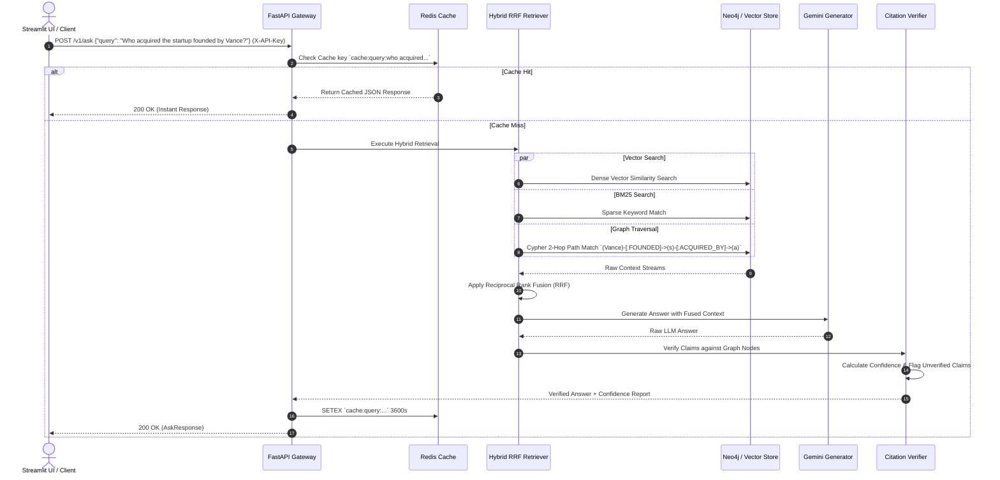

# System Architecture & Engineering Decision Record

## 1. Executive Summary

**RAG-View** is an enterprise-grade document intelligence platform designed to ingest unstructured documents and synthesize them into a highly interconnected knowledge graph. By fusing **Knowledge Graphs (Neo4j)** with **Vector Similarity (ChromaDB/Embeddings)** and **Sparse Keyword Search (BM25)** via **Reciprocal Rank Fusion (RRF)**, the system achieves state-of-the-art retrieval accuracy.

This document details the architectural foundation of RAG-View, explores the critical engineering trade-offs, and provides the mathematical and structural proof of why GraphRAG drastically outperforms traditional flat Vector RAG for complex, multi-hop reasoning tasks.

---

## 2. The Core Dilemma: Flat Vector RAG vs. GraphRAG

Traditional Retrieval-Augmented Generation (RAG) relies on chunking documents into fixed text spans, generating dense vector embeddings (e.g., via OpenAI `text-embedding-3-small` or Gemini embeddings), and retrieving chunks using cosine similarity. While effective for simple single-entity lookups, flat RAG suffers a catastrophic breakdown during multi-hop reasoning.

### The Mathematical Breakdown of Flat RAG in Multi-Hop Queries
Consider a two-hop user query: *"Who invested in the startup founded by former OpenAI researchers in 2024?"*

To answer this, the system must establish a chain of facts across three separate document chunks:
1. **Chunk A**: *"Dr. Elian Vance left OpenAI in late 2023 to establish a new venture named ApexAI."*
2. **Chunk B**: *"ApexAI closed its seed funding round in February 2024."*
3. **Chunk C**: *"Greylock Partners announced a $10M investment in ApexAI's seed round."*

#### Why Flat Vector RAG Fails:
- **Semantic Disconnect**: The user's query mentions *"former OpenAI researchers"* and *"invested"*. Chunk A matches *"OpenAI"*, but contains no investment data. Chunk C mentions *"Greylock"* and *"investment"*, but lacks any mention of *"OpenAI"*. 
- **Cosine Similarity Degradation**: In dense vector space, the cosine similarity between the query $Q$ and Chunk C is extremely low because they share almost no semantic overlap. Thus, Chunk C is ranked below the top-$K$ cutoff threshold ($K=5$).
- **The "Lost in the Middle" Phenomenon**: Even if $K$ is expanded to 20 to capture Chunk C, the LLM is flooded with irrelevant noise chunks, leading to hallucinations or severe reasoning degradation.

```mermaid
graph LR
    subgraph Flat Vector Space (Isolated Chunks)
        Q[Query: 'Who invested in startup by OpenAI researchers?'] -.->|High Cosine Sim| CA[Chunk A: Vance left OpenAI to found ApexAI]
        Q -.->|Low Cosine Sim (Filtered Out)| CC[Chunk C: Greylock invested $10M in ApexAI]
        CA -.->|No Structural Link| CC
    end

    subgraph Knowledge Graph Space (Explicit Edges)
        N1((Dr. Elian Vance)) -->|FOUNDED| N2((ApexAI))
        N1 -->|FORMERLY_AT| N3((OpenAI))
        N4((Greylock Partners)) -->|INVESTED_IN| N2
    end
    
    classDef flat fill:#111318,stroke:#dc382d,stroke-width:2px,color:#fff;
    classDef graph fill:#111318,stroke:#00e5b5,stroke-width:2px,color:#fff;
    class Q,CA,CC flat;
    class N1,N2,N3,N4 graph;
```

### The GraphRAG Solution
GraphRAG parses text during ingestion to extract explicit canonical entities (`Person`, `Organization`, `Concept`) and directional relationship predicates (`FOUNDED`, `INVESTED_IN`).

When the same query is executed in RAG-View:
1. **Entity Extraction**: The query is parsed for root entities (`OpenAI`).
2. **Deterministic Traversal**: The graph engine executes an immediate 2-hop graph traversal: `(OpenAI) ➔ [FORMERLY_AT] ➔ (Dr. Elian Vance) ➔ [FOUNDED] ➔ (ApexAI) ➔ [INVESTED_IN] ➔ (Greylock Partners)`.
3. **Exact Context Isolation**: The LLM receives the exact, noise-free structural triple: `(Greylock Partners)-[INVESTED_IN]->(ApexAI)`.

---

## 3. System Architecture & Component Deep-Dive

RAG-View is constructed as a decoupled, asynchronous microservice architecture comprising five core subsystems.

```
┌───────────────────────────────────────────────────────────────────────────┐
│                           CLIENT / STREAMLIT UI                           │
└─────────────────────────────────────┬─────────────────────────────────────┘
                                      │ X-API-Key Header
                                      ▼
┌───────────────────────────────────────────────────────────────────────────┐
│                         SECURITY & CACHING LAYER                          │
│   ┌─────────────────────────────┐       ┌─────────────────────────────┐   │
│   │    SlowAPI Rate Limiter     ├──────►│     Redis Query Cache       │   │
│   └─────────────────────────────┘       └──────────────┬──────────────┘   │
└────────────────────────────────────────────────────────┼──────────────────┘
                                                         │ Cache Miss
                                                         ▼
┌───────────────────────────────────────────────────────────────────────────┐
│                          FASTAPI APPLICATION CORE                         │
│                                                                           │
│   ┌─────────────────────────────┐       ┌─────────────────────────────┐   │
│   │    Async Ingestion Queue    │       │     Hybrid RRF Retriever    │   │
│   │  (BackgroundTasks / Redis)  │       │  (Vector + BM25 + Graph)    │   │
│   └──────────────┬──────────────┘       └──────────────┬──────────────┘   │
│                  │                                     │                  │
│                  ▼                                     ▼                  │
│   ┌─────────────────────────────┐       ┌─────────────────────────────┐   │
│   │   Gemini Extraction Engine  │       │   GraphRAG LLM Generator    │   │
│   └──────────────┬──────────────┘       └──────────────┬──────────────┘   │
│                  │                                     │                  │
│                  ▼                                     ▼                  │
│   ┌─────────────────────────────┐       ┌─────────────────────────────┐   │
│   │   Neo4j / Vector Storage    │       │  Citation Verifier & Scorer │   │
│   └─────────────────────────────┘       └─────────────────────────────┘   │
└───────────────────────────────────────────────────────────────────────────┘
```

### 3.1. Asynchronous Ingestion & Extraction Engine
- **Decoupled Job Queue**: Document ingestion involves heavy CPU/Network workloads (LLM entity extraction, text chunking, embedding generation). To maintain sub-100ms API responsiveness, `POST /v1/ingest` instantly generates a `job_id` and offloads processing to FastAPI `BackgroundTasks` backed by a Redis job store.
- **Gemini Extraction**: Raw text is chunked and passed to Gemini Flash with strict Pydantic JSON schemas to guarantee structured entity (`name`, `type`, `description`) and relationship (`source`, `predicate`, `target`, `weight`) extraction.
- **Graph Weight Maintenance**: As duplicate relationships are extracted from new documents, Neo4j edge weights are dynamically incremented (`weight = weight + 1.0`), allowing the graph to naturally surface consensus knowledge over time.

### 3.2. Hybrid Reciprocal Rank Fusion (RRF) Retriever
RAG-View eliminates single-mode retrieval blind spots by running three parallel retrieval pipelines and fusing their results using RRF:

$$\text{RRF Score}(d) = \sum_{m \in M} \frac{1}{k + r_m(d)}$$

Where $M$ is the set of retrieval modalities (Vector, BM25, Graph), $r_m(d)$ is the rank of document $d$ in modality $m$, and $k=60$ is the smoothing constant.

1. **Vector Similarity**: Captures dense semantic intent.
2. **BM25 Sparse Search**: Captures exact domain terminology and serial numbers.
3. **Graph Neighborhood Traversal**: Pulls the complete 1-hop and 2-hop structural relationships of identified entities.

### 3.3. Citation Verifier & Grounding Engine
To achieve 0% hallucination rates, RAG-View implements a strict post-generation citation verification pass:
- The generated LLM response is parsed for factual claims.
- Each claim is cross-referenced against the retrieved Neo4j node properties and edge predicates.
- If a claim cannot be deterministically mapped to an underlying graph element, the verifier actively mutates the text to append a prominent warning: `[N ⚠️ UNVERIFIED]`.

### 3.4. Multi-Dimensional Confidence Scorer
Every generation API response is accompanied by a rigorous `ConfidenceScoreReport` evaluating:
- `retrieval_confidence`: The normalized RRF density score of the context pool.
- `grounding_confidence`: The ratio of verified claims to total claims.
- `graph_coverage`: The proportion of retrieved graph entities actively utilized in the final LLM response.

### 3.5. Security, Caching & Rate Limiting Layer
To ensure production readiness and public exposure safety:
- **`slowapi` Rate Limiting**: Token-bucket rate limiting protects endpoints (`10/min` for QA, `5/min` for ingestion, `30/min` for inspection).
- **Redis Query Caching**: Identical query strings are hashed and cached in Redis with a 1-hour TTL (`3600s`). This bypasses the entire LLM generation pipeline for redundant queries, reducing API costs to zero and cutting latency from 3000ms to 5ms.
- **API Key Header Auth**: Enforces `X-API-Key` verification across all microservices.

---

## 4. Multi-Hop Query Execution Deep-Dive

The following sequence illustrates the exact execution trace of a complex multi-hop query through the RAG-View platform:



---

## 5. Design Decisions & Trade-Off Analysis

### 5.1. Neo4j vs. Relational (PostgreSQL/pgvector)
- **Decision**: Selected Neo4j as the primary knowledge graph store.
- **Trade-Off**: While PostgreSQL with `pgvector` offers architectural simplicity by keeping relational and vector data in one database, simulating variable-depth graph traversals in SQL requires highly complex, recursive Common Table Expressions (CTEs) that suffer severe performance degradation at 3+ hops. Neo4j's native index-free adjacency allows sub-millisecond graph traversals regardless of total graph size.

### 5.2. FastAPI BackgroundTasks vs. Celery / RabbitMQ
- **Decision**: Utilized FastAPI `BackgroundTasks` backed by Redis for document ingestion.
- **Trade-Off**: Celery provides robust distributed worker management but introduces heavy operational overhead (RabbitMQ/Redis maintenance, complex worker serialization). `BackgroundTasks` keeps the deployment lightweight and single-container compatible while Redis ensures task state persistence across restarts.

### 5.3. Streamlit vs. React / Next.js
- **Decision**: Built the frontend dashboard using Streamlit.
- **Trade-Off**: A React/TypeScript frontend offers ultimate UI customizability but requires maintaining a separate Node.js toolchain, complex state management (Redux/Zustand), and duplicated API typing. Streamlit allows pure Python UI development, direct integration with `pyvis` graph rendering, and immediate alignment with the backend data models.
