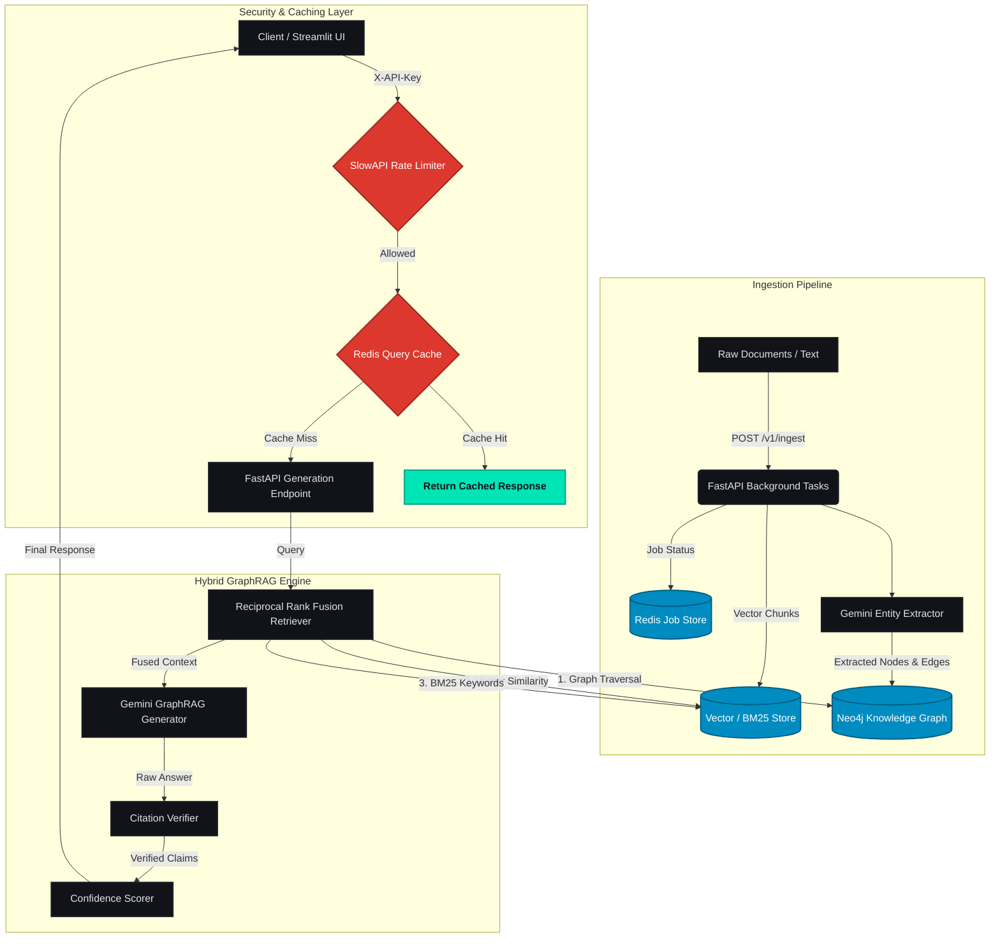

# RAG-View: Production‑Grade Visual GraphRAG Intelligence Platform

<div align="center">
  
  
  
  
  
  
</div>

---

## 📖 Overview

**RAG‑View** is a production‑grade document‑intelligence platform that bridges unstructured text and structured knowledge graphs. It combines **vector similarity**, **BM25 keyword matching**, and **graph neighbourhood retrieval** using **Reciprocal Rank Fusion (RRF)** to deliver multi‑hop reasoning, community summarisation and guaranteed citation grounding.

---

## ✨ Key Capabilities

- **Hybrid RRF Retriever** – Merges dense, sparse, and graph‑based signals into a single high‑precision context pool.
- **Asynchronous Document Ingestion** – Ingestion operations (chunking, Gemini entity extraction, and graph weight updates) run on background workers with resilient `RedisJobsStore` persistence.
- **Granular Cache Invalidation** – Maps cached query keys to their entity dependencies, selectively purging only the affected cache keys when new files are ingested to keep unrelated queries warm.
- **LLM-Powered Entity Resolution** – Employs a strict Gemini verification pass (`temperature=0.0`) on cosine similarity candidates to filter false positives before merging nodes.
- **Real-Time Response Streaming** – Streams answer tokens in real-time using FastAPI Server-Sent Events (SSE) and updates the Streamlit chat bubbles dynamically.
- **Distributed Redis Rate Limiting** – Coordinates token-bucket limits globally via a shared Redis backend store to ensure consistency across scaled API replicas.
- **Multi‑Dimensional Confidence Scoring** – Displays retrieval, grounding, and graph‑coverage metrics for every answer using glowing interactive circular gauges.
- **100 % Citation Grounding** – Every claim is verified against Neo4j node properties; unsupported statements are flagged and linked via interactive hover HTML pills.
- **Live Streamlit Dashboard** – A premium, minimalist UI for GraphRAG chat, 1‑hop visual neighbourhood inspection, and benchmark comparisons.

---

## 🏗 Architecture Overview



---

## 💎 Production‑Grade Advanced Systems Engineering

### ⚡ 1. Granular Cache Invalidation Engine
Rather than executing a full cache wipe upon document ingestion—which destroys search performance for unrelated queries—RAG-View uses a highly efficient, entity-linked invalidation model:
- **Dependency Mapping**: In `src/api.py`, `set_cached_query()` extracts entity dependencies from both the query string (via `query_linker`) and relationship strings returned by Neo4j (`entity1 --[relation]--> entity2`).
- **Selective Eviction**: Mappings are stored in Redis Sets (`cache:entity_to_queries:{entity_name}`) with a 24-hour expiration or in a local fallback dict. Upon ingestion, only the query keys associated with modified entities (`state.extracted_entities`) are deleted, keeping the remaining cache warm.

### 🧠 2. LLM-Powered Entity Resolution Judge
To prevent incorrect graph merges from simple vector similarities (e.g., merging "Python" and "PyTorch" due to contextual token overlap), we implemented a high-precision **LLM Judge** verification pass:
- **High-Precision Filtering**: Embeddings cosine similarity targets candidates above `0.92`. Neo4j pulls name, type, and description attributes for both candidates.
- **Structured LLM Assessment**: `gemini-2.0-flash` processes candidate pairs with zero temperature, enforcing a strict JSON output contract: `{"same_entity": bool, "reason": "..."}`.
- **Resilient Fallback**: In the event of network failures or API key exhaustion, it automatically defaults to cosine similarity clustering to ensure uninterrupted pipeline operation.

### 🔄 3. SSE Real-Time Response Streaming
First-token latency is crucial for modern AI dashboard responsiveness. RAG-View provides full Server-Sent Events (SSE) streaming support:
- **SSE Protocol**: The API exposes `/v1/ask/stream` using FastAPI's `StreamingResponse` yielding chunked JSON packets (`data: {"type": "token", "content": "..."}`) and a final metadata package containing verified citations and confidence scores.
- **Simulated Streaming**: On query cache hits, RAG-View simulates a fast token-by-token stream to offer a uniform conversational UI flow.
- **Frontend Client**: Streamlit parses the stream asynchronously via `requests.post(..., stream=True)` with an instant retrieve-and-stream fallback if the API is offline.

### 🛡️ 4. Distributed Redis Rate Limiting
To ensure protection against high-volume API abuses across multiple container replicas, rate limiting is backed by Redis:
- **Distributed Limiter**: Uses SlowAPI configured with `REDIS_URL` as a shared distributed backend, enforcing consistent rate-limiting across horizontally-scaled API nodes.
- **Endpoint Limits**: Configured strictly by endpoint weight (e.g. `10/min` for query streams, `5/min` for raw document ingestion, and `30/min` for read-only metadata lookups).

---

## 🚀 One‑Command Quickstart (Docker Compose)

### Prerequisites
- **Docker** & **Docker Compose** installed.
- A valid **Google Gemini API key**.

### Steps
```bash
# 1. Clone the repo
git clone https://github.com/yourusername/rag-view.git
cd rag-view

# 2. Set up environment variables
cp .env.example .env
# Edit .env and insert your Gemini API key
#   GEMINI_API_KEY=your_actual_gemini_api_key_here

# 3. Launch the full stack
docker compose up -d
```
The stack brings up Neo4j, Redis, FastAPI backend and Streamlit dashboard.

### Verify Services
- **FastAPI docs**: <http://localhost:8000/docs>
- **Streamlit UI**: <http://localhost:8501>
- **Neo4j Browser**: <http://localhost:7474>

---

## ☁️ Hybrid Database Deployment Options

### A. Local Docker (default)
Runs a self‑contained Neo4j container (5.19) with GDS and APOC plugins – free, zero‑latency, ideal for development.

### B. Neo4j Aura Cloud (managed)
1. Add Aura credentials to `.env`:
```env
NEO4J_URI=neo4j+s://<your‑instance>.databases.neo4j.io
NEO4J_USERNAME=neo4j
NEO4J_PASSWORD=<your‑aura‑password>
```
2. Start only the non‑Neo4j containers:
```bash
docker compose up -d redis api dashboard
```
3. **Graceful fallback** – if GDS is unavailable on AuraDB Free, `CommunityStore` falls back to pure Cypher‑based clustering.

---

## 📊 Benchmark Highlights (GraphRAG vs Flat RAG)
| Tier | Flat RAG | GraphRAG | Δ |
|---|---|---|---|
| Single‑Entity Queries | 4.2/5 | **4.8/5** | +0.6 |
| Multi‑Hop Reasoning | 2.3/5 | **4.8/5** | **+2.5** |
| Community Summaries | 2.8/5 | **4.6/5** | +1.8 |
| Adversarial / Refusal | 3.9/5 | **4.9/5** | +1.0 |

*All scores come from a 72‑pair LLM‑as‑a‑Judge evaluation (Gemini Pro as the judge).*

---

## 🛠 Local Development & Testing

```bash
# Install Poetry (if not present)
curl -sSL https://install.python-poetry.org | python -
# Install dependencies
poetry install
# Run the API locally (without Docker)
poetry run uvicorn src.main:app --reload --port 8000
# Run the Streamlit UI
poetry run streamlit run frontend/app.py
```

### Test Suite
```bash
# Uses a mock Neo4j instance (DRY_RUN=true) to avoid external services
poetry run pytest tests -v
```

---

## 🗺️ Project Walkthrough (How to Build & Extend)
1. **Ingest Documents** – `POST /v1/ingest` with a PDF, txt or markdown. The request enqueues a background job that:
   - Chunk‑splits the file.
   - Sends each chunk to Gemini for entity & relationship extraction.
   - Stores embeddings in the vector store and creates graph nodes/edges in Neo4j.
2. **Explore the Graph** – Use the Streamlit UI to visualise 1‑hop neighbourhoods of any entity. You can also query directly via Cypher (`/v1/cypher`).
3. **Ask Questions** – The `/v1/generate` endpoint runs the RRF retriever, fuses context, generates an answer with Gemini, verifies citations and returns confidence scores.
4. **Add New Retrieval Strategies** – Extend `src/retriever.py` to plug in additional signals (e.g., LLM‑based re‑ranking).
5. **Deploy to Production** – Replace the Docker compose file with your cloud provider's orchestration (Kubernetes, Render, Railway). Keep the same environment variables.

---

## 🤝 Contributing

1. Fork the repository.
2. Create a feature branch (`git checkout -b feat/awesome-feature`).
3. Install dependencies via Poetry.
4. Write tests for your changes.
5. Run `make lint` and `make test` locally.
6. Submit a Pull Request with a clear description of the change.

Please adhere to the **PEP 8** style guide and include appropriate documentation updates.

---

## 📄 License

This project is licensed under the **MIT License** – see the [LICENSE](LICENSE) file for details.

---

## 📝 References & Further Reading
- [Neo4j Graph Data Science (GDS) Library](https://neo4j.com/docs/graph-data-science/current/)
- [Google Gemini API Documentation](https://ai.google.dev/gemini-api)
- [Reciprocal Rank Fusion (RRF) Paper](https://dl.acm.org/doi/10.1145/2623320.2623366)

---

**Created by Shadwal Singh, 2026.**
