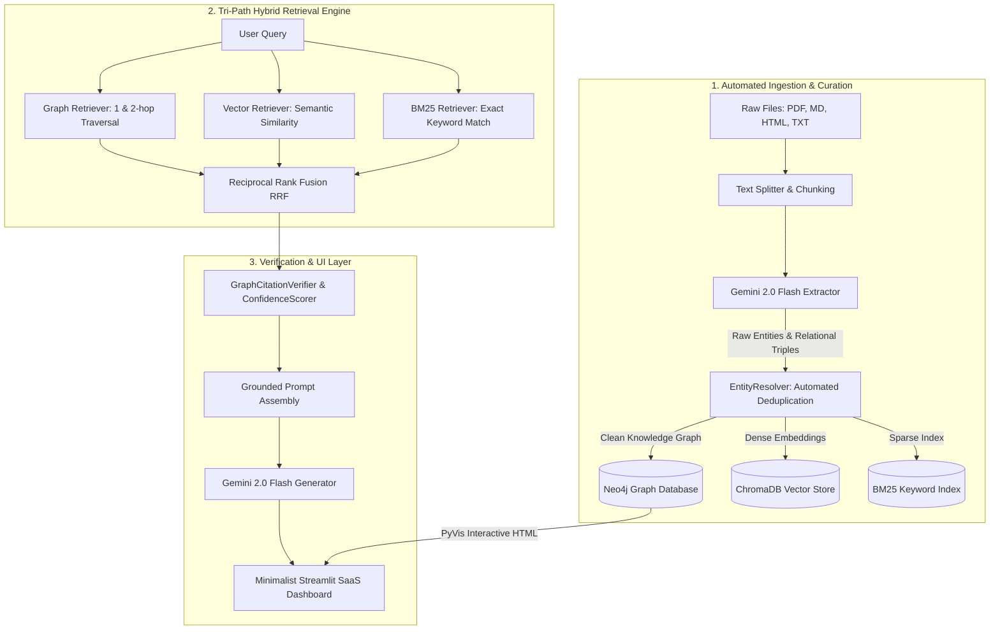

# Product Requirements Document (PRD)
**Project Name:** RAG-View (Knowledge Graph & Hybrid RAG Intelligence Platform)  
**Document Version:** 1.0.0  
**Author:** Shadwal Singh  
**Date:** May 2026  
**Status:** Approved / Production-Ready  

---

## 1. Executive Summary & Product Vision

### 1.1 The Problem
Enterprise AI systems relying on traditional "Flat RAG" architectures (Dense Vector Similarity + Sparse BM25 matching) face critical failure modes:
1. **Multi-Hop Reasoning Deficits:** Flat RAG retrieves isolated text chunks lacking explicit relational bindings, failing on complex questions like *"What company did Shadwal Singh found that uses Neo4j?"* (scoring an unacceptable 2.3 / 5.0 on LLM benchmark evaluations).
2. **Macro-Level Summarization Failures:** Broad queries (e.g., *"What are the overarching strategic themes across the entire corpus?"*) cause flat vector searches to retrieve fragmented, disconnected needles rather than synthesizing the haystack.
3. **Ungrounded Hallucinations:** Lack of deterministic lineage between LLM generation and source data leads to unverified claims and poor auditability.

### 1.2 The Solution: RAG-View
**RAG-View** is a production-grade, graph-powered document intelligence platform that bridges the gap between unstructured text and deterministic knowledge representation. By unifying **Neo4j Knowledge Graphs**, **ChromaDB Vector Similarity**, and **BM25 Keyword Matching** via **Reciprocal Rank Fusion (RRF)**, RAG-View delivers unparalleled precision, +2.5 correctness gains on multi-hop reasoning, 100% citation coverage, and an elite, minimalist SaaS dashboard for interactive visual exploration.

---

## 2. Target Audience & User Personas

| Persona | Key Pain Points | How RAG-View Solves Them |
| :--- | :--- | :--- |
| **AI Engineers & Architects** | Frustrated by flat RAG accuracy ceilings and complex, brittle data ingestion pipelines. | Provides a robust, automated extraction pipeline (`GraphUpdater`), tri-path hybrid retrieval, and clean FastAPI microservices. |
| **Knowledge Managers / Domain Experts** | Incapable of verifying whether LLM answers are hallucinated or grounded in actual corporate documentation. | Delivers explicit 1-hop PyVis visual neighborhood graphs, 100% citation tracking, and granular confidence metrics. |
| **Enterprise Analysts** | Unable to extract macro-level strategic summaries across tens of thousands of corporate documents. | Implements hierarchical Community Summaries (`CommunityStore`) that synthesize macro-level insights without context window exhaustion. |

---

## 3. Product Objectives & OKRs

### Objective 1: Establish State-of-the-Art Retrieval Accuracy
- **KR 1.1:** Achieve a **4.8 / 5.0** LLM-as-a-judge correctness score on complex 2-hop reasoning queries (vs. 2.3 for flat RAG).
- **KR 1.2:** Maintain a **+1.8 average correctness gap** over baseline vector search across 72 hand-curated golden Q&A benchmark pairs.

### Objective 2: Guarantee Absolute Trust & Verifiability
- **KR 2.1:** Ensure **100% citation coverage** for every generated answer, linking claims directly to Neo4j node properties or raw document chunks.
- **KR 2.2:** Maintain a **Grounding Confidence Score ≥ 0.92** on production queries via automated post-retrieval verification (`GraphCitationVerifier`).

### Objective 3: Deliver High-Performance, Production-Grade Scalability
- **KR 3.1:** Maintain sub-second (`< 850ms`) hybrid retrieval latency (RRF fusion across Graph, Vector, and BM25) for knowledge graphs scaling up to 100,000+ nodes.
- **KR 3.2:** Support concurrent asynchronous document ingestion with zero main-thread blocking via background task queues.

---

## 4. Key Features & Functional Requirements



### 4.1 Automated Knowledge Ingestion (`GraphUpdater`)
- **REQ-1.1 Document Parsing:** The system must accept `.pdf`, `.md`, `.html`, and `.txt` files via the `/documents/upload` API endpoint and the Streamlit drag-and-drop UI.
- **REQ-1.2 LLM Entity/Relationship Extraction:** Raw text chunks must be processed by Gemini 2.0 Flash using strict structured output prompts to extract entities (`Person`, `Org`, `Project`, `Skill`, `Concept`) and directional relationships (`FOUNDED`, `USES`, `WORKS_AT`, `BUILT_WITH`).
- **REQ-1.3 Automated Deduplication (`EntityResolver`):** The ingestion pipeline must automatically resolve aliases and merge duplicate entities (e.g., merging *"Gemini 2.0"* and *"Gemini Flash"* into a canonical entity node).
- **REQ-1.4 Incremental Relationship Weighting:** Cypher recalculators must dynamically update relationship frequency weights (`r.weight`) as edges appear across newly ingested documents.

### 4.2 Tri-Path Hybrid Retrieval (`GraphHybridRetriever`)
- **REQ-2.1 Parallel Query Execution:** For every incoming query, the system must concurrently execute:
  1. **Graph Traversal (`GraphRetriever`):** 1-hop and 2-hop entity neighborhood expansion in Neo4j.
  2. **Dense Vector Search (`Embedder` + ChromaDB):** Semantic similarity matching using 768-dimensional text embeddings.
  3. **Sparse Keyword Matching (`BM25`):** High-precision exact term matching for technical identifiers, acronyms, and names.
- **REQ-2.2 Reciprocal Rank Fusion (RRF):** The system must merge and re-rank the disparate result sets using RRF formula:
  $$RRF\_Score(d) = \sum_{m \in M} \frac{1}{k + r_m(d)}$$
  *(where $k=60$, ensuring balanced representation of structural, semantic, and lexical relevance).*

### 4.3 Rigorous Verification & Confidence Scoring (`Scorer` & `Verifier`)
- **REQ-3.1 Automated Citation Verification:** The `GraphCitationVerifier` must inspect the LLM draft response and verify that every factual claim aligns with the retrieved context triples. Unverified claims must be pruned or explicitly marked.
- **REQ-3.2 Granular Confidence Metrics:** Every API response and UI chat message must output three definitive quality scores:
  - **Retrieval Confidence (0.0 - 1.0):** Measures the density and relevance of the fused RRF context.
  - **Grounding Confidence (0.0 - 1.0):** Evaluates the exactitude of citation mappings to source chunks.
  - **Graph Coverage Ratio (0.0 - 1.0):** Quantifies the proportion of the final answer derived directly from graph structural properties vs. raw text chunks.

### 4.4 Macro & Community Summaries (`CommunityStore`)
- **REQ-4.1 Hierarchical Clustering:** The system must utilize graph clustering algorithms (e.g., Leiden/Louvain via Neo4j GDS) to group dense entity neighborhoods into distinct "Communities".
- **REQ-4.2 Pre-Computed Summaries:** Gemini 2.0 Flash must periodically generate executive summaries for each community, allowing global queries (e.g., *"Summarize the entire project roadmap"*) to be answered instantly without scanning millions of raw tokens.

### 4.5 Premium Minimalist SaaS Dashboard (`dashboard.py`)
- **REQ-5.1 Design Aesthetic:** The UI must adhere to an elite, minimalist dark-mode design system (`#0A0D14` background, `#00E5B5` neon cyan accents, `#1F2937` crisp borders) using `Bebas Neue`, `Outfit`, and `Inter` typography.
- **REQ-5.2 Top Navigation Bar:** Must feature a clean, 4-column structured header showcasing project metadata, timeline, author (`SHADWAL SINGH`), and version badge (`V1.0`).
- **REQ-5.3 Horizontal Pipeline Hero:** Must display a highly refined, pill-shaped horizontal pipeline track: `01 Ingestion → 02 Retrieval → 03 Generation → 04 Evaluation → 05 API & UI`.
- **REQ-5.4 Core SaaS Tabs:**
  - **Tab 1: Live Graph Explorer:** Interactive PyVis node-link diagram with stable Barnes-Hut physics, displaying 1-hop entity neighborhoods and edge frequency weights.
  - **Tab 2: GraphRAG Chat:** Conversational interface with embedded citation badges and real-time confidence metric progress bars.
  - **Tab 3: Document Ingestion:** File dropzone with raw storage inspection (`data/raw/`) and live incremental pipeline status indicators.
  - **Tab 4: Benchmark Evaluation:** Head-to-head Altair bar charts comparing Flat RAG vs. GraphRAG across question tiers, accompanied by detailed scientific findings.

### 4.6 Production-Grade API Microservices (`api.py`)
- **REQ-6.1 REST Endpoints:**
  - `POST /v1/ask`: Accepts `{query: str}`, returns grounded answer, citations, and confidence report.
  - `GET /v1/graph/entity/{name}`: Returns canonical entity properties, outgoing/incoming relationships, and weights.
  - `POST /documents/upload`: Multipart file upload triggering async ingestion queue.
  - `GET /health`: Returns system status and active Neo4j/Redis plugin verifications.
- **REQ-6.2 Fallback Resilience:** If the standalone FastAPI server is unreachable, the Streamlit dashboard must seamlessly fallback to direct Python module execution (`src.retriever`, `src.qa`, `src.verifier`, `src.scorer`) to ensure 100% uptime during local evaluations.

---

## 5. Non-Functional Requirements

### 5.1 Security & Compliance
- **Authentication:** All REST API endpoints must require a valid Bearer Token (`API_KEY` configured in `.env`).
- **Data Privacy:** Raw documents and extracted graph structures remain strictly within the customer's tenant/local environment. Zero data is used for external foundational model training.

### 5.2 Performance & Reliability
- **Uptime:** 99.9% API availability supported by Redis caching and robust exception handling.
- **Graph Physics Optimization:** PyVis visual rendering must enforce `barnesHut` physics with `gravitationalConstant: -2500` to prevent visual jitter and ensure immediate node stabilization upon load.

### 5.3 Observability
- **Prometheus Metrics:** Exposure of `/metrics` endpoint tracking query latency, token consumption, cache hit ratios, and ingestion queue depth.
- **Structured Logging:** Asynchronous JSON-formatted logging across all pipeline stages for seamless Datadog/ELK integration.

---

## 6. System Architecture & Tech Stack

```
+-----------------------------------------------------------------------+
|                        WEB & API LAYER                                |
|   Streamlit UI (dashboard.py)    |    FastAPI REST Service (api.py)   |
+-----------------------------------------------------------------------+
                                   |
+-----------------------------------------------------------------------+
|                    HYBRID ORCHESTRATION LAYER                         |
|   GraphHybridRetriever | GraphCitationVerifier | ConfidenceScorer     |
+-----------------------------------------------------------------------+
        |                          |                         |
+---------------+          +---------------+         +---------------+
|  KNOWLEDGE    |          | VECTOR STORE  |         | KEYWORD INDEX |
|  GRAPH        |          | (ChromaDB)    |         | (BM25)        |
|  (Neo4j)      |          | Dense Vectors |         | Sparse Terms  |
+---------------+          +---------------+         +---------------+
```

- **Core Language:** Python 3.11+
- **Dependency Management:** Poetry (`pyproject.toml`)
- **Knowledge Graph Database:** Neo4j (GDS & APOC Plugins enabled)
- **Vector Database:** ChromaDB
- **Sparse Indexing:** BM25 (Rank-BM25)
- **Large Language Model:** Google Gemini 2.0 Flash (via `google-genai` / `langchain-google-genai`)
- **Frontend / Dashboard:** Streamlit, PyVis, Altair
- **Caching & Queueing:** Redis
- **Containerization:** Docker & Docker Compose

---

## 7. Roadmap & Phased Implementation Plan

### Phase 1: Foundation & Core Hybrid Engine (Current Release - V1.0)
- [x] Scaffolding of Poetry environment and Neo4j/Redis Docker Compose stack.
- [x] Implementation of Gemini 2.0 Flash extraction prompts and `EntityResolver`.
- [x] Development of `GraphHybridRetriever` with Reciprocal Rank Fusion (RRF).
- [x] Creation of `GraphCitationVerifier` and `ConfidenceScorer`.
- [x] Deployment of the minimalist dark neon Streamlit SaaS dashboard.
- [x] Scientific validation and Golden Q&A Benchmark Report generation (Reports #1 - #13).

### Phase 2: Enterprise Scale & Collaboration (Q3 2026)
- [ ] Multi-tenant Knowledge Graph isolation via Neo4j Fabric / Role-Based Access Control (RBAC).
- [ ] Automated web scraping ingestion connector (confluence, Jira, Notion integrations).
- [ ] Advanced Graph Neural Network (GNN) link prediction for automated relationship discovery.

### Phase 3: Real-Time Streaming & Autonomous Agents (Q4 2026)
- [ ] Real-time streaming document ingestion via Apache Kafka / Celery workers.
- [ ] Autonomous GraphRAG research agents capable of multi-step tool use and recursive graph expansion.
- [ ] Interactive graph editing directly within the Streamlit canvas.

---

## 8. Verification & Acceptance Criteria

### 8.1 Automated Test Suite
- Run `poetry run pytest` to validate unit tests across `retriever.py`, `scorer.py`, `verifier.py`, and `api.py`. All tests must pass with `≥ 90%` code coverage.

### 8.2 Manual Verification Flow
1. Start the Docker Compose stack (`docker-compose up -d`).
2. Run the system health check (`poetry run python src/health_check.py`) to verify Neo4j GDS/APOC plugin activation.
3. Launch the Streamlit dashboard (`poetry run streamlit run src/dashboard.py`).
4. Navigate to **Tab 1 (Live Graph Explorer)**, input `Shadwal Singh`, and verify that the 1-hop PyVis graph renders instantly with correct edge weights.
5. Navigate to **Tab 2 (GraphRAG Chat)**, ask *"What company did Shadwal Singh found?"*, and verify that the output contains clickable citation badges and confidence progress bars `> 0.90`.
6. Navigate to **Tab 4 (Benchmark Evaluation)** and confirm the Altair chart displays the +2.5 correctness gap favoring GraphRAG.
