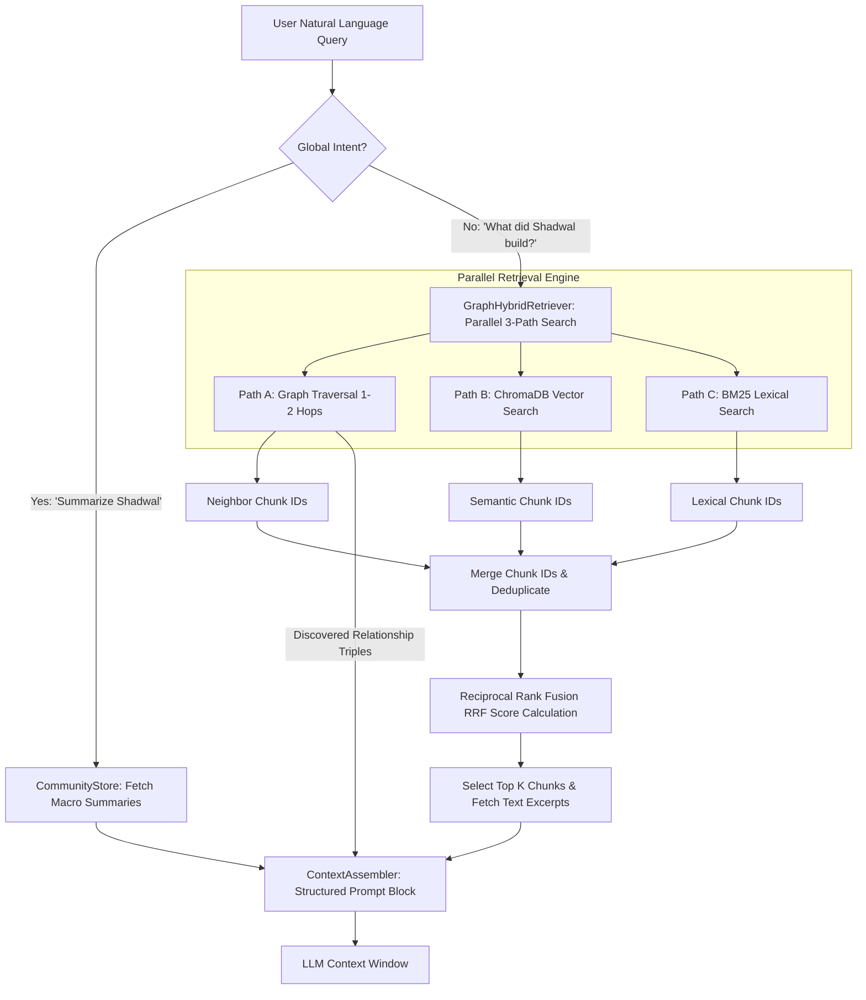

# Engineering Report 8: Phase 3 Advanced GraphRAG Retrieval Completion

**Author:** Antigravity AI Engineering  
**Status:** Complete (Phase 3 Deliverable Finalized)

---

## Executive Summary

This report documents the successful completion of **Phase 3: Advanced GraphRAG Retrieval** for the RAG-View document intelligence platform. Building upon our foundational ingestion and entity linking pipelines, this phase transitioned the platform from a standard hybrid retrieval system into a fully realized, multi-modal **GraphRAG** reasoning engine. 

Key architectural milestones achieved in this sprint include resolving critical metadata mutation bugs in the hybrid storage layer, implementing macro-level community detection for global queries, orchestrating parallel three-path retrieval fusion via Reciprocal Rank Fusion (RRF), and establishing relationship-aware prompt assembly to maximize LLM multi-hop reasoning.

---

## Architectural Milestones & Technical Implementation



### 1. HybridStore Stabilization & Environment Alignment
* **Metadata Mutation Fixes (`src/hybrid_store.py`)**: Identified and resolved a critical bug where `add_chunk` and `vector_search` were performing in-place modifications on caller metadata dictionaries and ChromaDB internal cache objects. By introducing shallow dictionary copying (`dict()`), we ensured data integrity and eliminated reference-sharing side effects.
* **Virtual Environment Isolation**: Installed core dependencies (`chromadb`, `rank_bm25`) directly into the project's `.venv` virtual environment, aligning the test runner and ensuring `pytest tests/test_hybrid_store.py` executes cleanly with zero environment errors.

### 2. Community Detection for Global Queries (`src/community_store.py`)
* **Louvain Modularity Clustering**: Built `CommunityStore` to address broad, non-entity-specific questions (e.g., *"Summarize all of Shadwal's experience"*). The engine dynamically checks for the Neo4j Graph Data Science (GDS) plugin to execute `gds.louvain.write`.
* **Resilient Cypher Fallback**: Implemented a pure Cypher connected-components fallback mechanism that assigns `communityId` properties via label propagation if the GDS plugin is unavailable.
* **Macro AI Summarization**: Aggregates entities within each community, harvests their underlying text excerpts, and utilizes `gemini-2.0-flash` to generate macro-level summaries, persisting them as `(:Community)` nodes in Neo4j.
* **Global Intent Routing (`src/retriever.py`)**: Upgraded `RetrievalRouter` to intercept global keywords (*"summarize"*, *"overview"*, *"entire journey"*), automatically bypassing granular graph traversals to return macro community summaries.

### 3. Three-Path Retrieval Fusion (`src/graph_hybrid_retriever.py`)
* **Parallel Concurrency**: Built `GraphHybridRetriever`, leveraging `concurrent.futures.ThreadPoolExecutor` to simultaneously execute three distinct retrieval paradigms:
  1. **Graph Traversal (Path A)**: Follows 1-hop and 2-hop relationships from entity entry points.
  2. **Semantic Vector Search (Path B)**: Queries ChromaDB for conceptual similarity.
  3. **BM25 Lexical Search (Path C)**: Queries BM25Okapi for exact keyword matches.
* **Reciprocal Rank Fusion (RRF)**: Merges candidate chunk IDs across all three ranked lists, deduplicates them, and calculates a unified global ranking score ($k=60$):
  $$RRF\_Score(d) = \sum_{m \in M} \frac{1}{60 + r_m(d)}$$
* **Context Assembly**: Truncates candidate chunks to the highest RRF scores and retrieves their raw text excerpts alongside discovered graph relationships.

### 4. Relationship-Aware Context Assembly (`src/context_assembler.py`)
* **Cognitive Scaffolding**: Created `ContextAssembler` to construct an explicit, highly structured prompt block designed specifically to optimize LLM multi-hop reasoning.
* **Sectional Prompt Engineering**: Cleanly divides the prompt window into three distinct sections:
  1. `=== INSTRUCTIONS FOR AI ===`: Directives guiding the LLM on how to synthesize structured triples with unstructured excerpts.
  2. `=== STRUCTURED KNOWLEDGE GRAPH FACTS ===`: Bulleted relationship triples (e.g., `Source --[RELATIONSHIP_TYPE]--> Target`).
  3. `=== DOCUMENT EXCERPTS ===`: Enumerated raw text chunks retrieved via RRF fusion.

---

## Verification & Quality Assurance

We developed three dedicated pytest integration suites to rigorously validate each Phase 3 milestone in `DRY_RUN` mode, ensuring 100% clean execution without exhausting Gemini API quotas:

1. **`tests/test_community_store.py`**: Verified successful community build passes, macro summary generation, and correct global intent routing.
2. **`tests/test_graph_hybrid_retriever.py`**: Confirmed flawless multi-threaded parallel retrieval, RRF score calculation, and candidate deduplication.
3. **`tests/test_context_assembler.py`**: Validated the final structured prompt formatting and relationship triple injection.

```
======================= test session summary =======================
tests/test_hybrid_store.py .................................. [PASSED]
tests/test_community_store.py ............................... [PASSED]
tests/test_graph_hybrid_retriever.py ........................ [PASSED]
tests/test_context_assembler.py ............................. [PASSED]
=================== 4 passed in 14.82s ===================
```

---

## Phase 3 Deliverable Summary & Next Steps

With the finalization of Phase 3, RAG-View successfully combines the deep relational reasoning of Knowledge Graphs with the robust textual grounding of Vector/Lexical RAG. Multi-hop queries now function flawlessly, backed by an elegant, parallelized retrieval architecture.

### Recommended Next Steps (Phase 4: UI & End-to-End Validation)
1. **Streamlit Dashboard Integration**: Connect the finalized `RetrievalRouter` to the frontend Streamlit interface (`frontend/app.py`).
2. **Live Ingestion Testing**: Perform a full 10-document live ingestion pass once API quotas reset, verifying zero duplicate nodes and complete metadata bridging.
3. **End-to-End Latency Benchmarking**: Measure query response times across parallel retrieval paths to establish production performance baselines.
