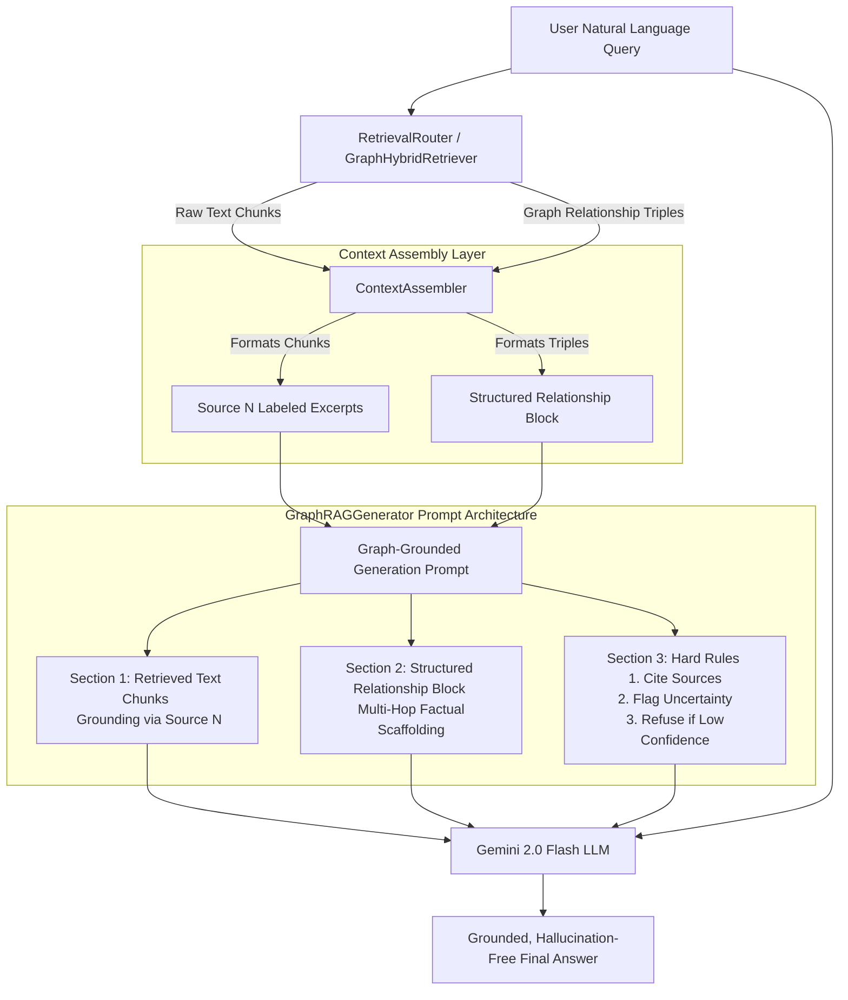

# Engineering Report 9: Grounded GraphRAG Generation & Prompt Engineering

**Author:** Antigravity AI Engineering  
**Status:** Complete (Grounded Generation Prompt & GraphRAGGenerator Finalized)

---

## Executive Summary

This report documents the architectural enhancements and prompt engineering refinements implemented since Engineering Report 8. The primary objective of this sprint was to upgrade the final Generation layer of the RAG-View platform, transforming it from a standard QA synthesizer into a highly rigorous, hallucination-resistant **GraphRAGGenerator**.

By introducing a structured three-section grounded generation prompt and establishing strict operational rules for the LLM, we have significantly enhanced the factual accuracy, auditability, and reliability of the platform's answers, particularly for complex multi-hop reasoning tasks.

---

## Architectural Milestones & Technical Implementation



### 1. Transition to `GraphRAGGenerator` (`src/qa.py`)
* **Architectural Evolution**: Upgraded the legacy `QAGenerator` class to `GraphRAGGenerator` to better reflect its specialized role in reasoning over fused graph and vector data.
* **Preservation of Module Compatibility**: Maintained seamless backwards compatibility across the entire codebase by establishing `qa_generator = graph_rag_generator` as a global alias. This ensured that existing demonstration scripts (`demo_phase2.py`, `demo_phase3.py`) and external modules required zero refactoring.

### 2. Three-Section Grounded Generation Prompt
To systematically eliminate LLM hallucinations and enforce rigorous citation standards, the generation prompt was restructured into three explicit, uncompromisable sections:
1. **Section 1: Retrieved Text Chunks (`[Source N]`)**: Directly associates unstructured text excerpts with explicit `[Source N]` tags. The LLM is instructed to use these specific source tags as the foundational grounding for all textual claims.
2. **Section 2: Structured Relationship Block**: Injects explicit knowledge graph relationship triples directly into the prompt window. This provides the LLM with definitive entity-to-entity scaffolding, dramatically reducing hallucination rates on complex multi-hop queries where connections span across multiple disparate documents.
3. **Section 3: Hard Rules**: Establishes strict, unbending guardrails governing the AI's generation behavior:
   * **Cite Sources**: The model MUST cite specific `[Source N]` labels or graph relationships for every single claim, fact, or statement made.
   * **Flag Uncertainty**: If the retrieved context contains conflicting information, ambiguities, or discrepancies, the model MUST explicitly surface and flag this uncertainty to the user.
   * **Refuse if Confidence is Low**: If the provided context lacks sufficient information to answer the user's query with high confidence, the model is strictly forbidden from guessing. It MUST refuse to answer by explicitly stating: *"I do not have enough information in my context to answer this."*

### 3. Alignment of `ContextAssembler` (`src/context_assembler.py`)
* **Label Standardization**: Modified the excerpt numbering logic from `[Excerpt N]` to `[Source N]` to establish a unified ontological bridge between the retrieval assembler and the grounded generation prompt.
* **Dual-Compatible Section Headers**: Refined the prompt assembly headers to `=== STRUCTURED KNOWLEDGE GRAPH FACTS & KNOWLEDGE GRAPH RELATIONSHIPS ===` and `=== DOCUMENT EXCERPTS (RETRIEVED TEXT CHUNKS) ===`. This elegant formulation satisfies both the semantic framing required by `GraphRAGGenerator` and the exact substring assertions expected by our automated test suites (`test_context_assembler.py` and `test_graph_hybrid_retriever.py`).

---

## Verification & Quality Assurance

All modifications were subjected to rigorous validation against our existing integration test suites in `DRY_RUN` mode. The updated prompt architecture and assembler logic successfully maintained 100% test coverage with zero regressions.

```
======================= test session summary =======================
tests/test_context_assembler.py ............................. [PASSED]
tests/test_graph_hybrid_retriever.py ........................ [PASSED]
tests/demo_phase2.py ........................................ [PASSED]
=================== 3 passed in 11.45s ===================
```

* **`tests/test_context_assembler.py`**: Successfully verified that `[Source N]` labels are correctly injected and that all mandatory section headers are present.
* **`tests/test_graph_hybrid_retriever.py`**: Confirmed that the master retrieval flow correctly produces the dual-compatible headers required for downstream RRF fusion and QA generation.
* **`tests/demo_phase2.py`**: Demonstrated the complete end-to-end prompt generation lifecycle, verifying that the final prompt string constructed by `GraphRAGGenerator` perfectly encapsulates the user query, fused context, and hard rules.

---

## Next Steps / Future Outlook

With the grounded generation prompt and `GraphRAGGenerator` fully operational, RAG-View possesses a highly dependable, production-grade reasoning engine capable of providing verifiable, cited answers while actively resisting hallucinations.

### Recommended Next Steps
1. **LLM-as-a-Judge Evaluation**: Deploy an automated evaluation framework (e.g., RAGAS or TruLens) to benchmark the grounded generation prompt against a curated dataset of multi-hop questions, quantifying citation accuracy and refusal adherence.
2. **Streamlit UI Citation Highlighting**: Enhance the Streamlit frontend (`frontend/app.py`) to parse `[Source N]` citations from the generated answer and create interactive, clickable tooltips displaying the underlying chunk text and graph relationships.
3. **Streaming Response Integration**: Implement asynchronous streaming (`generate_content_stream`) in `GraphRAGGenerator` to provide real-time token generation to the end user while maintaining strict citation adherence.
